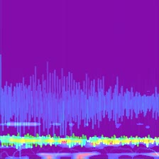

# Predominant-musical-instrument-recognition-Using-HSA-IMF-CNN

I use Hilber Transform Analysis for Musical instrument classification.
I got about 85% classification accuracy at 11 musical instruments.

CAM(Classification Activate Mapping)


## prepare dataset
I Use IRMAS dataset for trainning.
https://www.upf.edu/web/mtg/irmas
It consist of 11 musical instrument.


## at local directory

1. Download Hilbert Spectral Analysis MATLAB code from http://web.nmsu.edu/~spsandov/HSA/index.html
>fix frequency and time length

```
frequency : 4500Hz
time length : 1/8s
```

2. Make HSA images Using Decompse Real world signal matlab code

3. resized output Images

>if image size is big,it consume many time for preprocessing.

```shell script
sh rescale.sh
```
## at jupyter notebook

1. load Datasets & Histogram equlization

2. trainning model

> if your image longer than 1920px, resize kernel size Vertical Long such as (3,5).

```
_________________________________________________________________
Layer (type)                 Output Shape              Param #   
=================================================================
conv2d_7 (Conv2D)            (None, 32, 480, 270)      896       
_________________________________________________________________
conv2d_8 (Conv2D)            (None, 32, 478, 268)      9248      
_________________________________________________________________
max_pooling2d_4 (MaxPooling2 (None, 32, 159, 89)       0         
_________________________________________________________________
dropout_5 (Dropout)          (None, 32, 159, 89)       0         
_________________________________________________________________
conv2d_9 (Conv2D)            (None, 64, 159, 89)       18496     
_________________________________________________________________
conv2d_10 (Conv2D)           (None, 64, 157, 87)       36928     
_________________________________________________________________
max_pooling2d_5 (MaxPooling2 (None, 64, 52, 29)        0         
_________________________________________________________________
dropout_6 (Dropout)          (None, 64, 52, 29)        0         
_________________________________________________________________
conv2d_11 (Conv2D)           (None, 128, 52, 29)       73856     
_________________________________________________________________
conv2d_12 (Conv2D)           (None, 128, 50, 27)       147584    
_________________________________________________________________
max_pooling2d_6 (MaxPooling2 (None, 128, 16, 9)        0         
_________________________________________________________________
dropout_7 (Dropout)          (None, 128, 16, 9)        0         
_________________________________________________________________
flatten_2 (Flatten)          (None, 18432)             0         
_________________________________________________________________
dense_3 (Dense)              (None, 512)               9437696   
_________________________________________________________________
dropout_8 (Dropout)          (None, 512)               0         
_________________________________________________________________
dense_4 (Dense)              (None, 11)                5643      
=================================================================
Total params: 9,730,347
Trainable params: 9,730,347
Non-trainable params: 0
```

reference

[1] IRMAS dataset : https://www.upf.edu/web/mtg/irmas

[2] HSA MATLAB code : http://web.nmsu.edu/~spsandov/HSA/codes.html

[3] S. Sandoval, P. L. De Leon, and J. M. Liss “Hilbert spectral analysis of vowels using intrinsic mode functions,” 2015 IEEE Workshop on Automatic Speech Recognition and Understanding (ASRU), pp.569-575, Dec. 2015.

[4] Keras Traffic Sign Classification : https://github.com/chsasank/Traffic-Sign-Classification.keras


